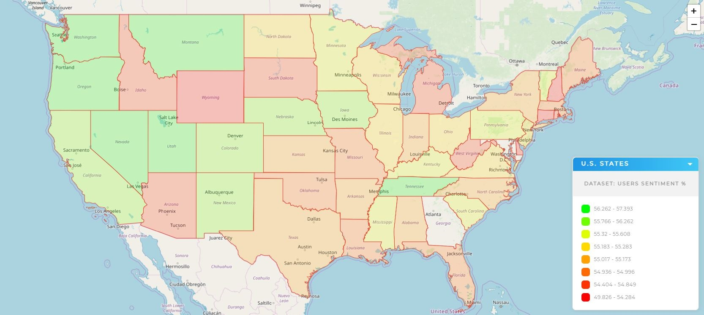
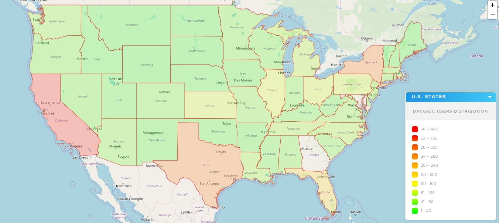
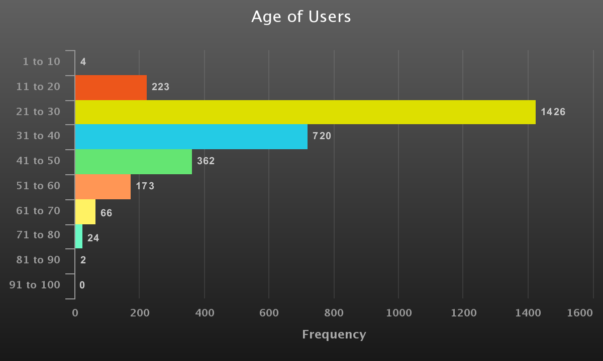
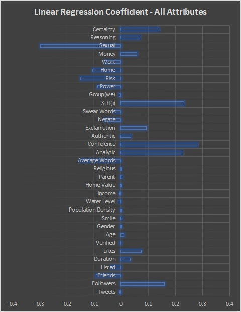

# Investigating factors affecting the Mental Health of Twitter Users via Sentiment Analysis
In this study, 3000 Twitter Users of all age groups, across the United States, were selected randomly for analysis. A total of 8.7 Million Tweets from those users were scrapped, and several attributes of the users were extracted by performing various analysis on the information posted in profile, their tweets, etc.

The following tools were used in the creation of our dataset to perform our analysis on:
1) **Tweepy API** - To obtain the user attribute details posted by the users on their profile.
2) **snscrape API** - To scrape random users and the past 3240 Tweets of each user from Twitter.
3) **Geopy API** - To convert the Location provided in a User's profile into coordinates.
4) **uszipcode API** - To convert location coordinates into zipcode and obtain demographic details such as Population, Population Density, Water Level, Median Income, Median housing price, etc. of that zipcode.
5) **LIWC Text Analyzer** - It was used to obtain the intensity of various different tones present in the Tweets of each User.
6) **VADER Sentiment Analyzer** - To obtain a sentiment score between 0 to 1, by processing all the Tweets of a User.

The following **map** shows the average **Sentiment (Mental Health indicator) Distribution** of Twitter Users across **United States**:

The following **map** shows the **distribution** of Users across **United States**:

The following graph shows the **age distribution** of the mined Users:

The following graph show the **final result** of the Study (i.e.) the **attributes of the users** which **positively & negatively** affect their **mental health**:

The **description of all Python Programs** in this project are specified below (in the order of execution):
1) **Final_User_Collection.py** - Scraps for random Twitter Users, and filters the ones within United States with profile photo containing a single face, and saves the obtained User's attributes in the /User_Details directory, and the User IDs in the "All_Users.csv" file.
     - freq_words_string_gen.py (reference only code) - Generates most common keywords for random search of Tweets (in Final_User_Collection.py), to scrape random English Users.
     - random_user_sampler.py (reference only code) - Code snippet from 'Final_User_Collection.py', which samples random English speaking Users on Twitter.
2) **Tweets_Scrapping_snscrape-All_Users.py** - Scrapes the last 3240 individual Tweets of all the (3000) user IDs present in the "All_Users.csv" file, and saves them in the /User_Tweets directory. Uses the Python mutiprocessing library for a very fast scrapping, and has resumability in case of intermittent program termination.
     - Tweets_Scrapping_snscrape.py (reference only code) - Contains the code snippet, which extracts the last 3240 Tweets of just 1 specified Twitter user.
3) **User_Tweet_Counter.py** - Counts the Tweets obtained from each user, and also calculates the avaerage tweets per month of each user to find their freqency of usage, and saves the results in 'Users_Count.csv' file.
4) 
